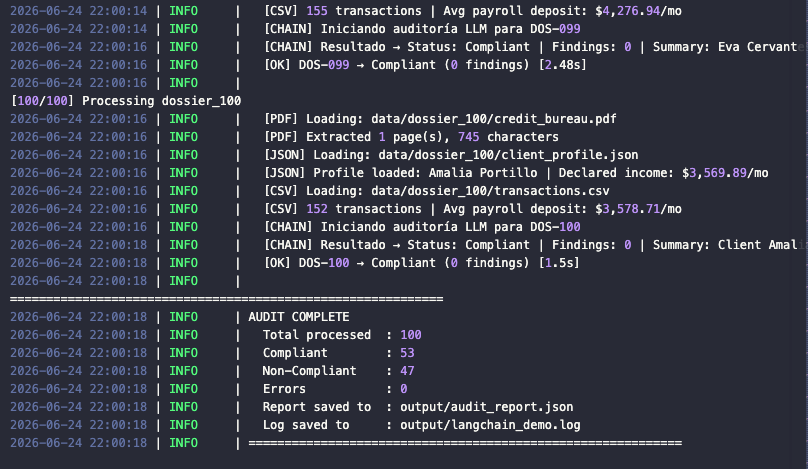
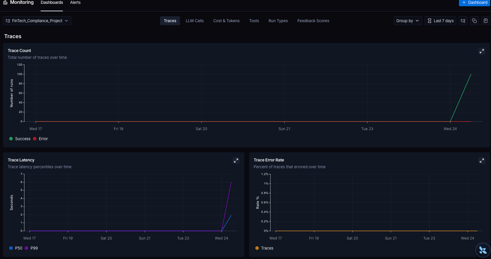
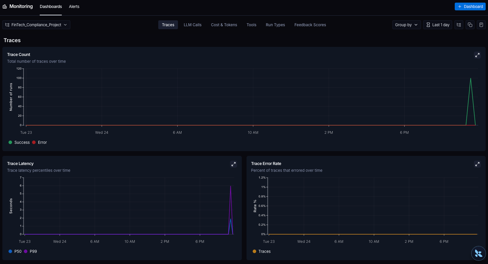
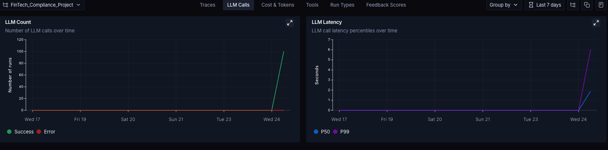
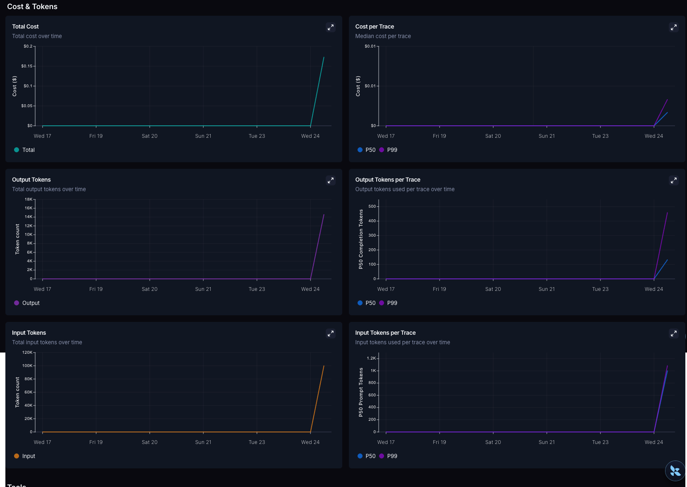

# FinTech Compliance Auditor — Apex Credit Solutions

Automated financial auditing pipeline built with LangChain (LCEL) and Claude (Anthropic). Processes 100 client dossiers in multi-format (PDF + JSON + CSV) and produces a structured compliance report validated with Pydantic.

---

## Project Structure

```
fintech_auditor/
├── data/
│   ├── dossier_001/
│   │   ├── credit_bureau.pdf      # Credit bureau history (PDF)
│   │   ├── client_profile.json    # Client self-declared profile (JSON)
│   │   └── transactions.csv       # 12 months of bank transactions (CSV)
│   ├── dossier_002/ ... dossier_100/
│   └── ground_truth.json          # Expected results for validation
├── src/
│   ├── __init__.py
│   ├── schema.py       # Pydantic output schema (AuditResult)
│   ├── loaders.py      # Multi-format file loaders (PDF, JSON, CSV)
│   ├── chain.py        # LCEL pipeline — LLM + prompt + parser
│   └── logger.py       # Dual-output logger (console + file)
├── scripts/
│   └── generate_data.py   # Synthetic data generator (run once)
├── tests/
│   ├── test_setup.py      # Environment / dependency check
│   └── test_one.py        # Single dossier smoke test
├── output/
│   ├── langchain_demo.log     # Auto-generated execution log
│   └── audit_report.json      # Final audit report (generated on run)
├── main.py             # Entry point — processes all 100 dossiers
├── requirements.txt
└── .env                # API keys (not committed — see .env.example)
```

---

## Architecture & Flow

```
data/dossier_NNN/
  ├── credit_bureau.pdf
  ├── client_profile.json
  └── transactions.csv
        │
        ▼
   [loaders.py]
   load_dossier()
   ├── load_pdf()        → extracted text string
   ├── load_json()       → Python dict
   └── load_csv_summary() → statistical summary dict
        │
        ▼
   [chain.py] — LCEL Pipeline
   RunnableLambda(prepare_inputs)
     │  Flattens dossier into prompt variables
     ▼
   ChatPromptTemplate
     │  System: compliance rules
     │  Human: structured dossier data
     ▼
   ChatAnthropic (claude-3-5-haiku, temperature=0.0)
     │
     ▼
   PydanticOutputParser
     │  Validates AuditResult schema
     ▼
   AuditResult {
     compliance_status: "Compliant" | "Non-Compliant"
     findings_count:    int (≥ 0)
     executive_summary: str (≤ 500 chars)
   }
        │
        ▼
   [main.py]
   Aggregates 100 results → output/audit_report.json
                          → output/langchain_demo.log
```

### Compliance Rules Applied by the LLM

| # | Rule | Trigger |
|---|------|---------|
| 1 | Income Discrepancy | Declared income differs from actual payroll deposits by > 20% |
| 2 | Low Credit Score | Credit score below 580 |
| 3 | Inconsistency Flag | High income claim (> $8,000/mo) paired with poor credit (< 620) |
| 4 | Missing Data | Any required document section is empty or unreadable |

---

## Prerequisites

- Python 3.10 or higher
- An [Anthropic API key](https://console.anthropic.com/)
- A [LangSmith account](https://smith.langchain.com/) (for tracing/observability)

---

## Setup

### 1. Clone and create virtual environment

```bash
git clone <repo-url>
cd fintech_auditor

python3 -m venv venv
source venv/bin/activate          # macOS / Linux
# venv\Scripts\activate           # Windows
```

### 2. Install dependencies

```bash
pip install -r requirements.txt
```

### 3. Configure environment variables

Copy the example file and fill in your keys:

```bash
cp .env.example .env
```

Edit `.env`:

```env
# Anthropic (LLM provider)
ANTHROPIC_API_KEY=sk-ant-...

# LangSmith (observability)
LANGCHAIN_TRACING_V2=true
LANGCHAIN_ENDPOINT=https://api.smith.langchain.com
LANGCHAIN_API_KEY=ls__...
LANGCHAIN_PROJECT=FinTech_Compliance_Project
```

### 4. Verify setup

```bash
python tests/test_setup.py
```

Expected output:
```
✓ Todas las librerías importadas correctamente
✓ ANTHROPIC_API_KEY configurada: Sí
✓ LANGSMITH_API_KEY configurada: Sí
✓ LangSmith tracing activo: true
```

---

## Running the Pipeline

### Option A — Full batch (all 100 dossiers)

```bash
python main.py
```

Console output per dossier:
```
2026-06-24 10:00:01 | INFO     | [001/100] Procesando dossier_001
2026-06-24 10:00:01 | INFO     |   [PDF] Cargando: data/dossier_001/credit_bureau.pdf
2026-06-24 10:00:01 | INFO     |   [PDF] Extraídas 1 página(s), 749 caracteres
2026-06-24 10:00:01 | INFO     |   [JSON] Perfil cargado: Jaime Jaime | Ingreso declarado: $12,678.37/mes
2026-06-24 10:00:01 | INFO     |   [CSV] 148 transacciones | Depósito promedio nómina: $9,613.12/mes
2026-06-24 10:00:01 | INFO     |   [CHAIN] Iniciando auditoría LLM para DOS-001
2026-06-24 10:00:03 | INFO     |   [OK] DOS-001 → Non-Compliant (2 findings) [2.1s]
```

Final summary:
```
============================================================
AUDITORÍA COMPLETADA
  Total procesados : 100
  Compliant        : 70
  Non-Compliant    : 30
  Errores          : 0
  Reporte guardado : output/audit_report.json
  Log guardado     : output/langchain_demo.log
============================================================
```

### Option B — Single dossier (smoke test)

```bash
python tests/test_one.py
```

Expected output:
```
Status  : Non-Compliant
Findings: 2
Summary : Client DOS-001 presents an income discrepancy of 30.6% between
          declared income ($12,678/mo) and actual payroll deposits ($9,613/mo).
          Additionally, high income claim is inconsistent with credit score of 580.
```

---

## Regenerating the Dataset

The 100 dossiers are pre-generated and committed to the repo. To regenerate them from scratch (e.g., to change parameters):

```bash
python scripts/generate_data.py
```

This will:
- Generate 100 synthetic client dossiers under `data/`
- ~30% of dossiers are intentionally Non-Compliant (inflated income, low credit scores)
- Save expected results in `data/ground_truth.json`

> **Note:** Regenerating data will overwrite all existing dossiers and change the ground truth.

---

## Output Files

### `output/audit_report.json`

```json
{
  "total_processed": 100,
  "total_errors": 0,
  "compliant": 70,
  "non_compliant": 30,
  "failed_dossiers": [],
  "audit_results": [
    {
      "dossier_id": "DOS-001",
      "compliance_status": "Non-Compliant",
      "findings_count": 2,
      "executive_summary": "Income discrepancy of 30.6% detected between declared income ($12,678/mo) and actual payroll deposits ($9,613/mo). High income claim inconsistent with credit score below 620.",
      "processing_time_s": 2.1
    },
    {
      "dossier_id": "DOS-002",
      "compliance_status": "Compliant",
      "findings_count": 0,
      "executive_summary": "No compliance violations detected. Income figures are consistent with actual deposit records. Credit score is within acceptable range.",
      "processing_time_s": 1.8
    }
  ]
}
```

### `output/langchain_demo.log`

Timestamped execution trail for every loader call and LLM invocation:

```
2026-06-24 10:00:01 | INFO     |   [PDF] Extraídas 1 página(s), 749 caracteres
2026-06-24 10:00:01 | INFO     |   [JSON] Perfil cargado: Jaime Jaime | Ingreso declarado: $12,678.37/mes
2026-06-24 10:00:01 | INFO     |   [CSV] 148 transacciones | Depósito promedio nómina: $9,613.12/mes
2026-06-24 10:00:01 | INFO     |   [CHAIN] Resultado → Status: Non-Compliant | Findings: 2 | Summary: ...
```

---

## Output Schema (Pydantic)

Defined in [src/schema.py](src/schema.py). The LLM is forced to produce exactly this structure:

| Field | Type | Constraint |
|---|---|---|
| `compliance_status` | `str` | Exactly `"Compliant"` or `"Non-Compliant"` |
| `findings_count` | `int` | `>= 0` |
| `executive_summary` | `str` | `<= 500 characters` |

Any response from the LLM that violates these constraints raises a `ValidationError` and the dossier is logged as failed.

---

## LangSmith Observability

With `LANGCHAIN_TRACING_V2=true`, every pipeline run is automatically traced in LangSmith under the project `FinTech_Compliance_Project`.

Dashboard metrics available:
- **Trace Count** — one trace per dossier processed
- **LLM Call Count** — one call per trace
- **Trace Latency** — per-dossier processing time
- **Token Metrics** — prompt and completion token counts
- **Error Count** — failed audits with exception details

---

## Deliverables Summary

### 1. Pipeline Source Code (LCEL)

| File | Role |
|---|---|
| `src/chain.py` | LCEL pipeline — prompt template → ChatAnthropic → PydanticOutputParser |
| `src/loaders.py` | Multi-format loaders: PDF (`pypdf`), JSON, CSV (`pandas`) |
| `src/schema.py` | Pydantic `AuditResult` schema with field validators |
| `src/logger.py` | Dual-output logger (console + file) |
| `main.py` | Batch orchestrator — processes all 100 dossiers and writes the report |

---

### 2. Infrastructure Log File

**Location:** `output/langchain_demo.log`

Timestamped execution trail for every loader call and LLM invocation across all 100 dossiers. Generated automatically on each `python main.py` run.



---

### 3. Structured Financial Audit Report

**Location:** `output/audit_report.json`

JSON report aggregating all 100 audit results with compliance verdict, findings count, executive summary, and processing time per dossier.

```json
{
  "total_processed": 100,
  "total_errors": 0,
  "compliant": 55,
  "non_compliant": 45,
  "failed_dossiers": [],
  "audit_results": [
    {
      "dossier_id": "DOS-001",
      "compliance_status": "Non-Compliant",
      "findings_count": 2,
      "executive_summary": "...",
      "processing_time_s": 2.1
    }
  ]
}
```

---

### 4. LangSmith Telemetry Dashboard

**Project:** `FinTech_Compliance_Project` — verified with `LANGCHAIN_TRACING_V2=true`

All dashboard captures are stored in `output/insights_dashboard/`.

#### Trace Count & Trace Latency & Error Rate

> 100 traces generated — one per dossier. P50 latency ~1.7s, P99 ~6s. Error rate: 0%.





#### LLM Call Count & LLM Latency

> 100 LLM calls — one `ChatAnthropic` invocation per dossier, all successful (0 errors).



#### Token Metrics & Cost

> ~100K input tokens total across the batch. ~18K output tokens. Median cost per trace: ~$0.0017.


